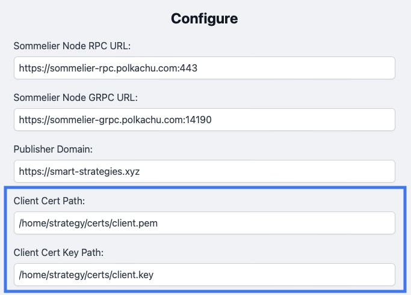
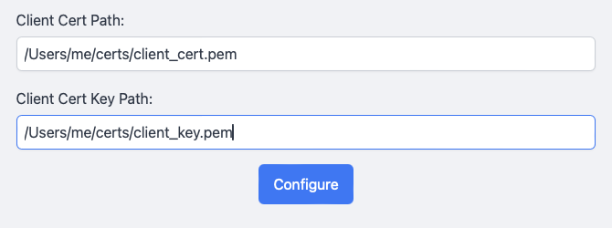

# Configuring Certificates for Strategist Terminal

## Purpose

This document provides step-by-step instructions on how to configure the Strategist Terminal to use the appropriate cryptographic materials for signing requests containing Cellar function calls in the Sommelier system.

## Overview

In the Sommelier system, the Strategist Terminal is considered the client, and each Validator's Steward instance is considered a server. Additionally, client and server identities are registered on the Sommelier chain, and are referred to as Publishers and Subscribers, respectively. This is because Cellar rebalances are ordinally executed using a Push model, where strategists publish the call data to subscribed Steward instances. Both publishers and subscribers generate their own self-signed certificates, and include their self-generated Certificate Authority with their on-chain identity registration so that each party can authenticate the other.

In order to establish a connection with any Subscriber, the Publisher's request must include the self-signed certificate and the signature of the key from which it is derived. That means publisher must provide the location of these materials to Strategist Terminal in its configuration.

## Configuring the Strategist Terminal with your Publisher identity

### Prerequisites

Before proceeding, ensure you have completed the following steps:

1. Generate self-signed certificates by following the instructions in the [Generating Certificates](https://github.com/PeggyJV/steward/blob/main/docs/04-GeneratingCertificates.md) guide.
2. Register a new Publisher identity on chain (link to be added).
3. Have the Strategist Terminal application installed and ready to run.

### Steps

1. Locate the paths to the following files:
   - Publisher self-signed certificate (not the CA)
   - Signing key (not the CA key)

2. Launch the Strategist Terminal application.

3. In the main interface, click on the "Settings" button.

4. In the Settings panel, locate the following fields:
   - "Client Cert Path"
   - "Client Cert Key Path"

5. Enter the respective paths for your Publisher self-signed certificate and signing key into these fields.

6. Click the "Configure" button to save your settings.

## Conclusion

After completing these steps, your Strategist Terminal should be properly configured with your Publisher identity. You can now use it to establish secure connections with Subscribers in the Sommelier system.

For any issues or further questions, please contact the Sommelier team.
